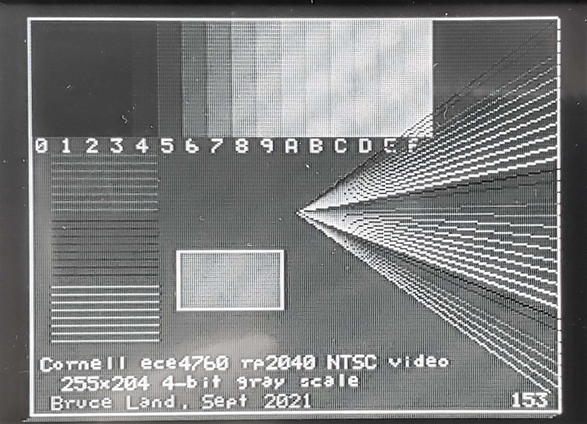
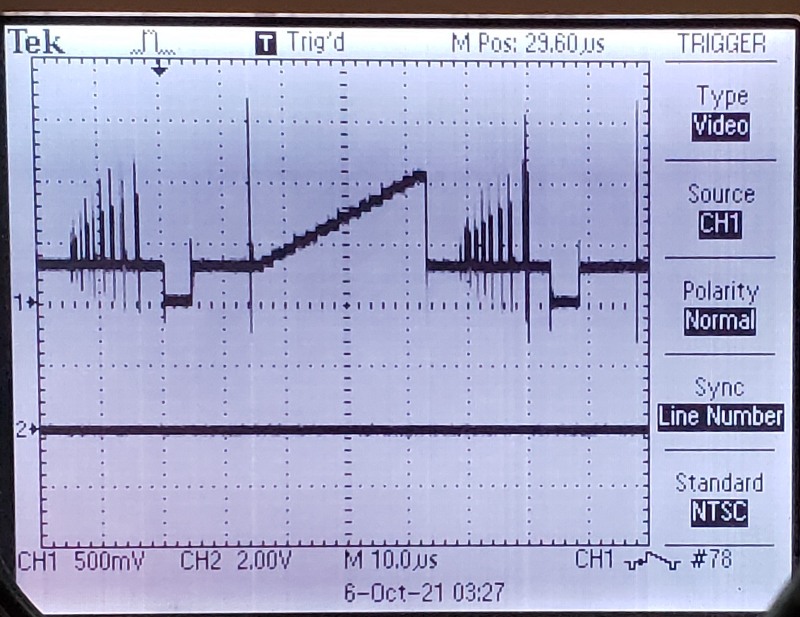

PIO generated 4-bit, 255x200 resolution, NTSC video
----
You might think that NTSC video (analog broadcast video standard in USA) is completely obsolete but it is not. The TV monitor which displays the image is quite stupid and must be sent sync and pixel data as a single time-varying voltage in realtime. As a result, the communication time demands can be high. On an 8-bit AVR, raster data transfer required 80% of the CPU! On a 32-bit PIC32 with DMA, the percentage dropped to 8%. Using the PIO parallel i/o processors on the rp2040, the ARM CPU time required to keep the monitor supplied with data is zero percent. CPU time is still required to generate the graphics content (e.g. points, lines, text), of course. 

The video system fit into two PIO state machines, with different clock rates. The slower machine generates the sync pulses, which have a minimum feature time of aound 5 uec. The faster machine generates the 4-bit video, with a bit time of around 0.2 uSec. The rate gives a pixel density of 256 points across the scan-line active time of 51 uSec. The rest of the 63.55 uSec scan line is used for sync and image centering.The sync and video are then combined using a five-bit DAC (schematic.png) to convert to a single voltage. Sync is defined as 0 volts, with black pixels at 0.3 volts, and white pixels at 1.3 volts. The start of each scan line is signaled by a sync pulse of just under 5 uSec. The start of a new frame is signalled by a sync pulse of about 180 uSec. The images below show the grey scale test image with the 4-bit gray levels indicated below 16 rectangles. One scan line is shown in the other image in which you can see the voltage video levels coresponding to the grey scale in rectangles in the upper-left corner of the image screen. The scan line image also shows two h-sync pulses and a series of very short pulses corresponding to the intersection if the scan line with the different intensity sloping lines to the right. 

